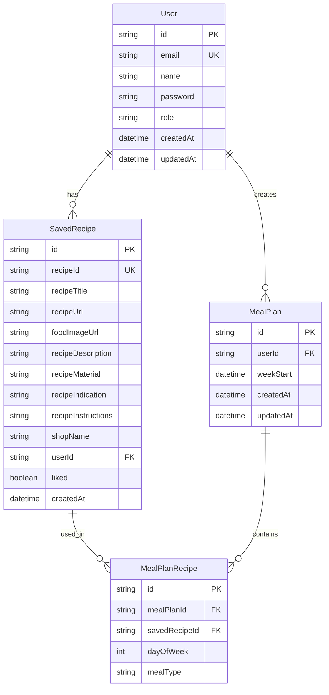
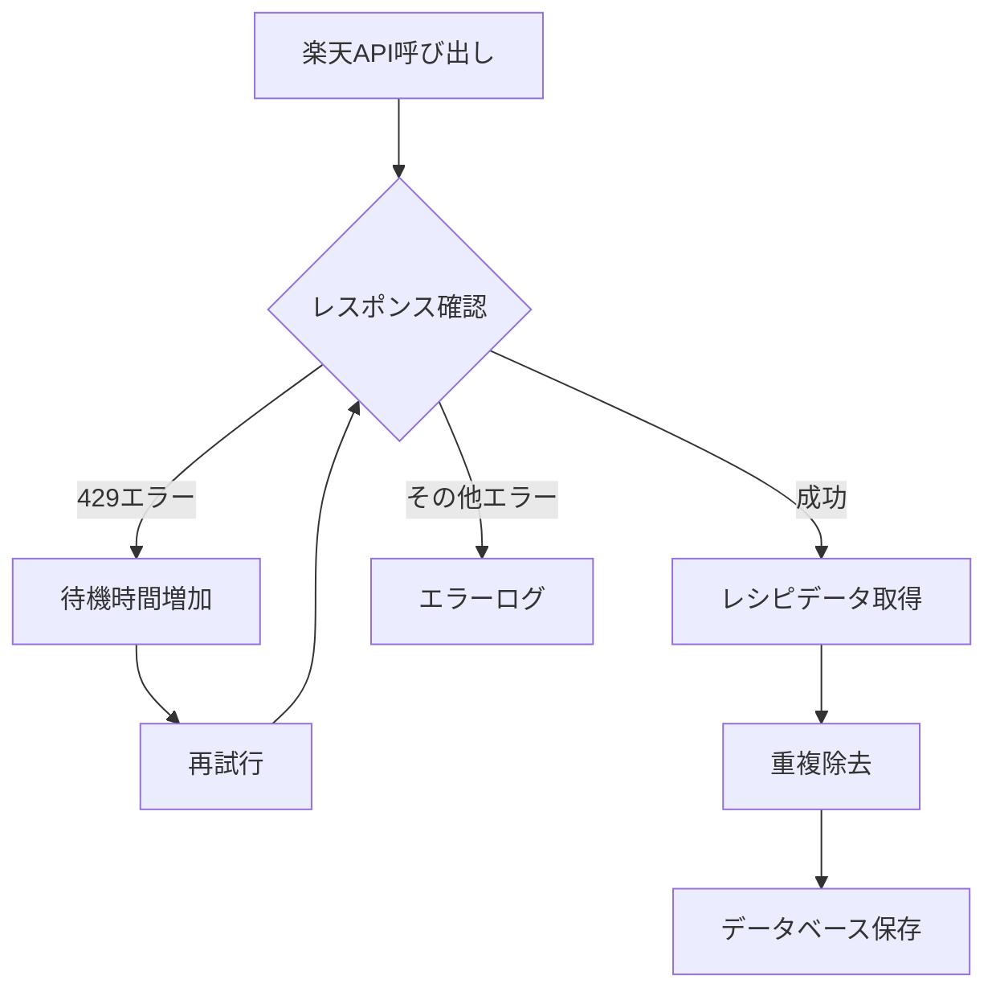

# MealMatch Web Application - 設計ドキュメント

## 概要

MealMatchは、楽天レシピAPIを活用した料理レシピ管理・献立計画アプリケーションです。ユーザーは大量の実際のレシピを閲覧し、お気に入りのレシピを保存して、週間献立を計画することができます。

## アーキテクチャ

### 技術スタック

- **フロントエンド**: Next.js 15.2.4 (React 19)
- **バックエンド**: Next.js API Routes
- **データベース**: SQLite (Prisma ORM)
- **UI**: Tailwind CSS + Radix UI
- **認証**: カスタム認証システム
- **外部API**: 楽天レシピAPI

### プロジェクト構造

```
maalmatch-web版2/
├── app/                    # Next.js App Router
│   ├── api/               # API Routes
│   │   ├── admin/         # 管理者用API
│   │   ├── meal-plans/    # 献立計画API
│   │   ├── recipes/       # レシピAPI
│   │   └── saved-recipes/ # 保存レシピAPI
│   ├── components/        # UIコンポーネント
│   └── pages/            # ページコンポーネント
├── prisma/               # データベース設定
│   ├── schema.prisma     # データベーススキーマ
│   ├── seed.ts          # 楽天APIシードスクリプト
│   └── seed-mock.ts     # モックデータシードスクリプト
├── lib/                  # ユーティリティ
└── components/ui/        # 再利用可能UIコンポーネント
```

## データベース設計

### ERD概要



### 主要テーブル

#### User
- ユーザー情報を管理
- 管理者権限の制御
- パスワードハッシュ化による認証

#### SavedRecipe
- 楽天APIから取得したレシピデータを保存
- ユーザーのお気に入りレシピ管理
- JSON形式での材料情報保存

#### MealPlan & MealPlanRecipe
- 週間献立計画の管理
- 曜日・食事タイプ別のレシピ割り当て

## API設計

### 楽天レシピAPI統合

#### データ取得戦略

1. **カテゴリ別検索**
   - 24のカテゴリから各5ページずつ取得
   - 肉料理、魚料理、野菜料理、デザートなど

2. **キーワード検索**
   - 85の人気キーワードから各3ページずつ取得
   - 唐揚げ、ハンバーグ、カレー、パスタなど

3. **レート制限対応**
   - 429エラー時の自動再試行（10秒→20秒→30秒）
   - リクエスト間の適切な待機時間
   - 最大200リクエストの制限

#### データ処理フロー



### 内部API設計

#### レシピ管理API
- `GET /api/recipes` - レシピ一覧取得
- `POST /api/saved-recipes` - レシピ保存
- `GET /api/saved-recipes` - 保存済みレシピ取得

#### 献立計画API
- `GET /api/meal-plans` - 献立計画取得
- `POST /api/meal-plans` - 献立作成
- `PUT /api/meal-plans` - 献立更新

#### 管理者API
- `GET /api/admin/stats` - 統計情報
- `GET /api/admin/recipes` - レシピ管理
- `POST /api/admin/recipes/bulk` - 一括レシピ作成

## セキュリティ設計

### 認証・認可

1. **パスワードハッシュ化**
   - scryptアルゴリズムによる安全なハッシュ化
   - ソルト付きハッシュの生成

2. **セッション管理**
   - UUIDベースのセッショントークン
   - 有効期限付きセッション

3. **管理者権限**
   - ロールベースアクセス制御
   - 管理者専用API保護

### データ保護

1. **入力検証**
   - APIリクエストの適切な検証
   - SQLインジェクション対策（Prisma ORM）

2. **環境変数管理**
   - 機密情報の環境変数化
   - 本番環境での適切な設定

## パフォーマンス最適化

### データベース最適化

1. **インデックス設計**
   - ユーザーID、レシピIDの複合インデックス
   - 検索クエリの最適化

2. **データ構造**
   - JSON形式での材料情報保存
   - 効率的なリレーション設計

### API最適化

1. **キャッシュ戦略**
   - レシピデータの適切なキャッシュ
   - 静的データの最適化

2. **ページネーション**
   - 大量データの効率的な表示
   - 無限スクロール対応

## 運用・保守

### データ管理

1. **シードスクリプト**
   - 楽天APIからの自動データ取得
   - モックデータ生成機能

2. **データ更新**
   - 定期的なレシピデータ更新
   - 重複データの自動除去

### 監視・ログ

1. **エラーハンドリング**
   - 適切なエラーメッセージ
   - ログ出力による問題追跡

2. **API制限監視**
   - 楽天API使用量の監視
   - レート制限の適切な管理

## 今後の拡張計画

### 機能拡張

1. **レシピ推薦システム**
   - ユーザーの好みに基づく推薦
   - 機械学習による最適化

2. **ソーシャル機能**
   - レシピ共有機能
   - ユーザー間のコミュニケーション

3. **栄養管理**
   - カロリー計算機能
   - 栄養バランス分析

### 技術的改善

1. **マイクロサービス化**
   - 機能別サービス分離
   - スケーラビリティ向上

2. **リアルタイム機能**
   - WebSocketによるリアルタイム更新
   - プッシュ通知機能

## 開発・デプロイメント

### 開発環境

```bash
# 開発サーバー起動
npm run dev

# データベース設定
npx prisma db push
npx prisma generate

# 楽天APIからレシピ取得
npm run db:seed-rakuten

# モックデータ生成
npm run db:seed-mock
```

### 環境変数設定

```env
DATABASE_URL="file:./dev.db"
RAKUTEN_APPLICATION_ID="your_rakuten_app_id"
ADMIN_EMAIL="admin@maalmatch.com"
ADMIN_PASSWORD="secure_password"
```

### デプロイメント

1. **本番環境準備**
   - 環境変数の適切な設定
   - データベースの初期化

2. **セキュリティ設定**
   - 管理者パスワードの変更
   - API キーの適切な管理

---

## 実装状況

✅ **完了済み**
- 基本的なNext.jsアプリケーション構造
- Prismaデータベース設計・実装
- 楽天レシピAPI統合
- 大量レシピデータ取得システム
- 基本的なUI/UXコンポーネント
- 管理者認証システム

🚧 **進行中**
- フロントエンド UI/UX改善
- レシピ検索・フィルタリング機能
- 献立計画機能の詳細実装

📋 **計画中**
- ユーザー認証システム
- レシピ推薦機能
- モバイル対応最適化 